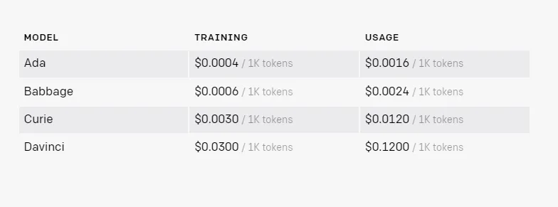

# GogoGPT

This repository is intended to contain the necessary sources to fine-tune OpenAI models using custom data comprising Felix Gogo shell commands, so that the fine tuned model can help developers execute gogo commands faster.

--------------------------------------------------------------------------------------------------------------

## What does fine-tuning a GPT-3 model mean?

Fine-tuning a GPT-3 model means training the pre-trained GPT-3 language model on a specific task or domain to improve its performance on that task.

GPT-3 is a large pre-trained language model that has been trained on a vast amount of diverse data. Fine-tuning allows you to adapt the pre-trained model to a specific task, such as sentiment analysis, machine translation, question answering, or any other language-based task.

During fine-tuning, you start with the pre-trained GPT-3 model and train it further on a smaller dataset that is specific to the task at hand. This process involves initializing the pre-trained model with the pre-trained weights and then fine-tuning the model’s parameters on the smaller dataset.

The fine-tuning process typically involves several rounds of training, where the model’s performance is evaluated on a validation set to determine if further training is necessary. Once the model achieves satisfactory performance on the validation set, it can be used to generate predictions on a new test set.

Fine-tuning a GPT-3 model can improve its accuracy and effectiveness for specific tasks, making it a powerful tool for natural language processing applications.

--------------------------------------------------------------------------------------------------------------

## What makes GPT-3 fine-tuning better than prompting?

* Fine-tuning GPT-3 on a specific task allows the model to adapt to the task’s patterns and rules, resulting in more accurate and relevant outputs.
* Prompting GPT-3 with a task-specific input can generate related but suboptimal results.
* Fine-tuning helps GPT-3 generalize better to new examples, as it can learn the underlying patterns and structures of the task.
* Fine-tuning enables GPT-3 to achieve better performance and accuracy, especially for complex or specialized tasks.
* Fine-tuning allows you to customize GPT-3 for a specific domain or industry, which can be highly valuable for businesses and organizations.

--------------------------------------------------------------------------------------------------------------

## Advantages of Fine-Tuning a GPT-3 Model

* Enhanced Accuracy: By training the model on specific tasks or datasets, it can improve performance, leading to greater accuracy.
* Improved Robustness: A fine-tuned model is more robust, meaning it’s less prone to overfitting than a non-fine-tuned model. This is particularly useful * when dealing with limited data.
* Better Generalization: Fine-tuning can lead to better generalization to new data, particularly for complex tasks or datasets.
Increased Interpretability: Fine-tuning can improve a model’s interpretability, making it easier to understand how it works and what it has learned.

--------------------------------------------------------------------------------------------------------------

## GPT-3 Fine tuning pricing

--------------------------------------------------------------------------------------------------------------

## The Plan Overview

For a question-answering task, the dataset might consist of a set of questions and their corresponding answers, which the model will use to learn how to generate accurate answers to similar questions.

That's why, the dataset is being prepared first to comprise the Gogo command examples to make the mode fine tuned. 

But considering the prices, it would be better to start off with baseline model - such as Ada and Babbage to first give it a try.

--------------------------------------------------------------------------------------------------------------

## Developer

Amit Kumar Mondal (admin@amitinside.com)

--------------------------------------------------------------------------------------------------------------

## Contribution 

Want to contribute? Great! Check out [Contribution Guide](https://github.com/amitjoy/GogoGPT/blob/main/CONTRIBUTING.md)

--------------------------------------------------------------------------------------------------------------

## License

This project is licensed under Apache License Version 2.0 

--------------------------------------------------------------------------------------------------------------